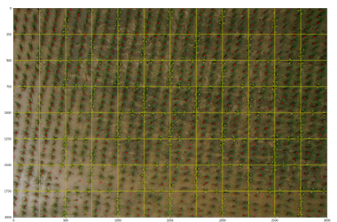
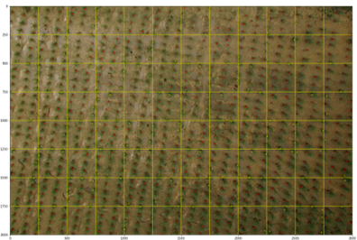
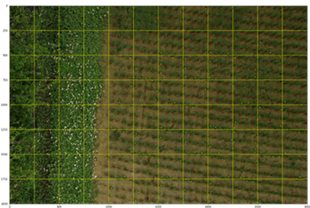

# Introduction
This is my final project of ML course at department of Statistic in NCKU, it's also the competition held by Aidea. Our aim is to train a ML/DL model which can detect the position of each rice in a UAV image of rice, there are two different kind of image, shoot after 21 days and after 48 days. In this project I use yolov5 model with only one class.

## aidea_Rice
Competition Information: https://aidea-web.tw/topic/9c88c428-0aa7-480b-85e0-2d8fb2fcf3fc

## Process flow
1. split each image into small images with identical size.
2. for training data draw the bounding box for each target adaptively (e.g. 21 days images have smaller bounding box while 48 days' bigger) accroding to the gound truth.
3. save the bounding box in yolov5 format.
4. train my yolov5 model for 21 days and 48 days respectively, tunning parameters and preprocessing.
5. predict the testing subimages with corresponding model.
6. restore the result of complete image from the result of the subimages.
7. tunning the result (e.g. the rice on the border of two subimages may be counted twice, solve this problem by thresholding the distance between each instance and combine the instances with distance less than the threshold)
8. mergeing top n best result and tunning like in step7. 
9. upload the result.

## tunning result example
This is an example for the result tunning as I mention in step7 of the process flow   
befre tunnning   
   
after tunning   
   

## training result (48 days for example)

## demo images
48 days images(1)   
   
48 days images(2)   
   
21 days images(1)   
   
